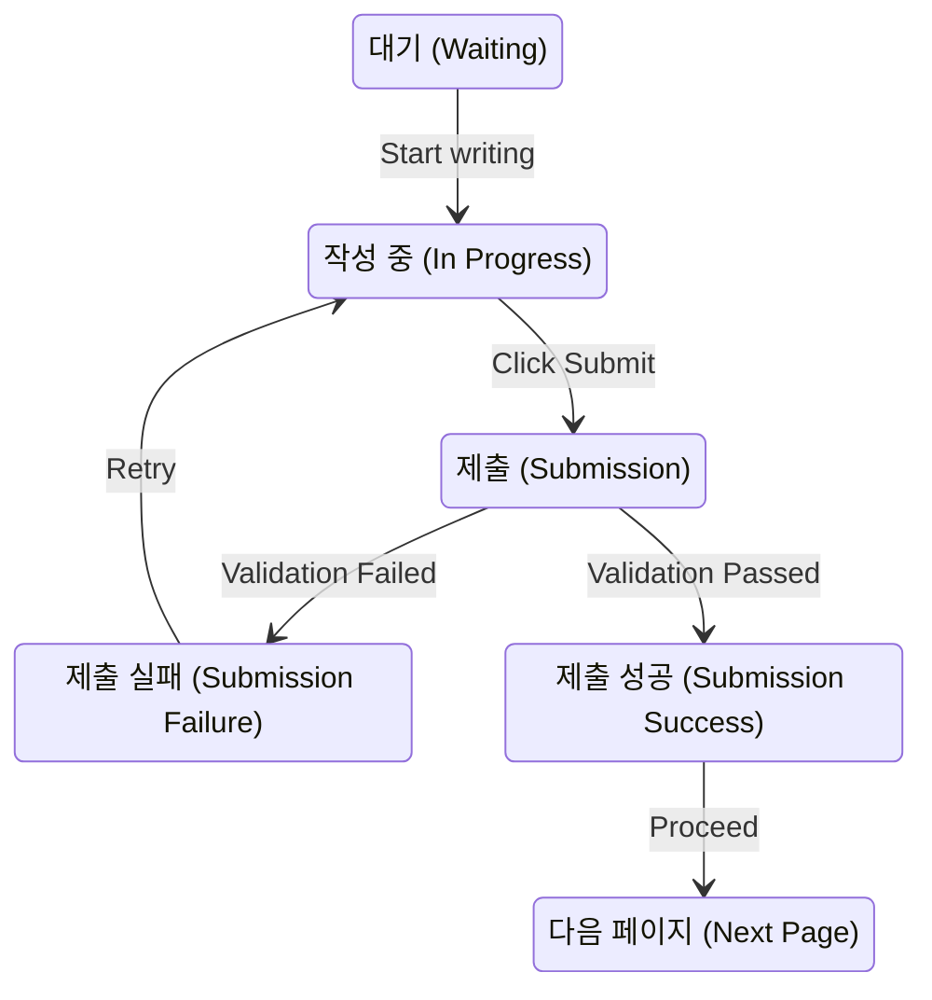

## RHF 라이브러리를 사용할 때, 기본 지식으로 알면, 도움이 되는 것들 

1. 반드시 'C:\Users\nextinnovation\Desktop\DJ-DEV\dev_notes\Hard skills\React Hook Form\3_제어 컴포넌트와 비제어 컴포넌트(우테코).md' 를 공부하고 올 것 

2.  비제어 컴포넌트가 무엇 인지 

3. react hook form 이 비제어 컴포넌트의 단점을 어떻게 subscribe 기능을 통해 극복하는지에 대한 맥락을 알고 있어야 함 


---

## 복습 순서 (241120 작성)

### 1. input, select, textarea 로 HTML 을 작성했다. 버튼을 클릭했을 대, submit 이벤트가 발생하게 되는데, 그에 따라 이벤트 핸들러가 input, select, textarea 의 값을 출력하는 코드를 살펴보도록. ( 출처 : Hard skills\React Hook Form\3_제어 컴포넌트와 비제어 컴포넌트(우테코).md)
```
- 여기에 추가로 쓰는 것 보다, 위 파일로 가서, 다시 복습하는게 나을 듯
```
 <br/>


### 2. '사용자가 값을 입력하고 -> 입력한 값이 DOM 으로 PUSH 되고 -> DOM 에 있는 값을 PULL 해오고 -> RENDER 되는 과정'에서 '신뢰 가능한 단일 출처' 의 필요성이 나온다. (#⭐⭐⭐ 신뢰 가능한 단일 출처의 개념을 말할 수 있어야 함) 
(출처 : Hard skills\React Hook Form\3_제어 컴포넌트와 비제어 컴포넌트(우테코).md)

<br/>

### 3. 그러면, 'form 데이터가 움직이는 흐름' 중에서, '신뢰가능한 단일 출처' 는 어디인가. (#⭐이 현상을 '데이터가 움직이는 관점' 으로 해석했다는 것⭐⭐)

```
그러면, '신뢰 가능한 단일 출처' 라는 것이 '하나의 상태는 한 곳에 있어야 한다.' 라면, '하나의 상태' 는 뭐지? 그리고 그 상태는 '어디에 있지?' 

그럼 우선, '상태' 라는 건 뭐지? 
```

<br/>

### 4. '상태란?' '상태의 개념에 비추어봤을 때, 신뢰 가능한 단일 출처' 란? '그러면, form 태그에는 어떤 상태 들이 있고, 어디에서 관리되는가?' (#신호등 예시)
```
- 일반적인 신호등은 빨강, 주황, 초록의 색을 표현할 수 있다. 각각 정지, 위험, 통과의 의미가 있지. 

- 신호등은 3가지 경우의 수를 갖는다. 

- 이때, 신호등이 '실제로 초록불' 을 비추면, 신호등은 '파란불을 비추는 상태' 가 된다. 

- 신호등이 표현할 수 있는 모든 경우의 수는 3개 이고, 그 중 하나가 선택되어, 실제로 표현된 것이 '상태' 다. 
(출처 : https://developer.mozilla.org/en-US/docs/Glossary/State_machine)
```

```
- 그러면, 이 시스템이 표현하고 있는 '모든 상태' 가 존재하고, 
- 그 중 하나의 상태가 되면, 그 상태에 대한 값은, '한 곳' 만 기억한다! 라고 보면 된다. (#⭐⭐⭐⭐⭐⭐)
```


```
- form 태그의 자식으로 input, select, textarea 등이 올 수 있다. 

- 이제, input 태그 에만 집중한다면, input 태그의 상태는, value 안에 담긴 값이 되는게 맞지 않을까? 왜냐면, input 태그가 가질 수 있는 경우의 수 중 하나의 경우가 들어온 거니까. 

- 그리고 이 '상태' (value) 는, value attribute 로 들어가고 -> value attribute 는 DOM 안에 있으니까, DOM 에 push 가 된다. 

- 그러면 값을 가져올 때도, DOM 에서 PULL 을 통해 최신화 하게 된다. 


CF. FORM 과 관련된 일련의 과정을 STATE MACHINE 관점에서 본다면
- 이것들이 가질 수 있는 '상태' 로는 
    1) 대기중 (아무것도 작성 안 되는 상태) 
    2) 작성중인 상태 
    3) 작성 완료를 클릭한 상태 
    4) 작성 결과물이 유효한지 확인하는 전환 과정 (transition) 
    5) 제출 성공 또는 실패의 상태
        - 실패의 경우, 다시 작성하는 페이지로 이동하게 됨

- 그러면, 위에 작성한 다양한 상태는 뭘까? form 제출 과정에서 사용자 흐름? 사용자의 상태? 라고 봐야 할까? 그리고 각 과정을 컨트롤 한다고 생각해야 할까? 
```




### 5. 그러면 React Hook Form 의 '신뢰 가능한 단일 출처' 란? 

```
- '신뢰 가능한 단일 출처' 란 '하나의 상태는 한 곳' 에만 있어야 한다는 의미 이다. 

- React 는 value 와 결합된 useState 의 state 를 'Single Source of Truth' 로 사용하지만 
    - state 로 보는 이유는, form 제출을 STATE MACHINE 관점에서 볼 때, '작성' 단계 다음 '제출' 인데, 이때, validation 검사를 할 때, state 에서 값을 가져오기 때문이라고 볼 수도 있지 않을까. (#⭐⭐⭐⭐⭐)
    (물론, 그냥, 단순하게, react 의 useState 의 state 라고도 하긴 하는데...)

- React Hook Form 은 DOM 에 값을 push 하고, 해당 태그의 값이 필요하면, DOM 에서 값을 PULL 해온다. 
    - DOM 에 PUSH 하는 원리는, input 태그 본연의 push 로직을 따른다. 
    - DOM 에서 PULL 하는 원리는 react 의 useRef 를 사용하여 DOM 에 있는 값을 PULL 해온다. 
    - input 에 넣은 값이 필요한 순간은, submission or validation. 이때, DOM 에서 값을 PULL 해온다. (#⭐⭐⭐⭐⭐ form 과정을 STATE MACHINE 관점으로 보고, 어디에서 PULL 해오는가를 중심으로 생각해보면 된다!!!)

- 그러면, 각 상태 및 전이(transition) 과정을 react hook form 이 어떻게 관리하는지가 나온다.
```


### 6. FORM 사용자 흐름을 STATE MACHINE 관점에서 바라보고, 각 STATE 및 Transition 을 react hook form 으로 관리하기 


#### WAITING 상태 

```
- 해당 상태에서 벌어지는 일 :
Inputs are idle, and no user interaction has occurred.
- RHF Role:
Initialize the form with defaultValues.
```

```tsx
const { register, handleSubmit } = useForm({
  defaultValues: { username: '', email: '' },
});
```

#### InProgress 상태 

```
- What Happens:
The user starts typing or interacting with the form.

- RHF Role:
Track input values in the DOM (uncontrolled components).
```
```tsx
<input {...register('username')} />
```


#### Submission 제출

```
- What Happens:
The user clicks the submit button, and RHF pulls values from the DOM.
- RHF Role:
handleSubmit is triggered, and RHF retrieves values via useRef.
```

```tsx
const onSubmit = (data) => {
  console.log(data); // Data is pulled from the DOM
};
<form onSubmit={handleSubmit(onSubmit)}>
  <input {...register('username')} />
  <button type="submit">Submit</button>
</form>
```


#### Submission Failure:

```
- What Happens:
Validation fails due to incorrect or missing values.
- RHF Role:
Perform validation using rules passed to register.
Error states are managed in formState.errors.
```

```tsx
<input
  {...register('email', { required: 'Email is required' })}
/>
{formState.errors.email && <p>{formState.errors.email.message}</p>}
```


#### Submission Success

```
- What Happens:
Validation passes, and the form is submitted successfully.
- RHF Role:
Proceed with the form submission logic in the onSubmit callback.
```

```tsx
const onSubmit = async (data) => {
  // Handle API submission here
  console.log('Submission Successful', data);
};
```


#### Next Page
```
- What Happens:
After successful submission, the user navigates to the next page.
- RHF Role:
Redirect or reset the form using RHF utilities like reset().
```

```tsx
const { reset } = useForm();
const onSubmit = (data) => {
  console.log(data);
  reset(); // Reset the form after successful submission
};
```


#### 전체 flow 

```tsx

import React from 'react';
import { useForm } from 'react-hook-form';

function FormExample() {
  const {
    register,
    handleSubmit,
    formState: { errors },
    reset,
  } = useForm({
    defaultValues: { username: '', email: '' },
  });

  const onSubmit = async (data) => {
    try {
      console.log('Validation Passed:', data);
      // Simulate successful submission
      reset();
    } catch (err) {
      console.error('Submission Failed:', err);
    }
  };

  return (
    <form onSubmit={handleSubmit(onSubmit)}>
      <div>
        <label>Username</label>
        <input {...register('username', { required: 'Username is required' })} />
        {errors.username && <p>{errors.username.message}</p>}
      </div>
      <div>
        <label>Email</label>
        <input {...register('email', { required: 'Email is required' })} />
        {errors.email && <p>{errors.email.message}</p>}
      </div>
      <button type="submit">Submit</button>
    </form>
  );
}

export default FormExample;
```


### 7. 이러한 흐름에서 REACT HOOK FORM 강의를 어떻게 들을 것 인가 

```
- 위의 이론적인 부분이 코드상 구체적으로 어떻게 구현이 되는가! 를 연결하기
    - 코드를 읽으면서 해당 부분에 대해 주석 달기

- 세세한 문법적인 구현체를 이해해야 함 
    ex) {...register('customer')} 에서 ... 이렇게 펼쳐주는 이유가 무엇인지 

```


### 8. 지금까지 이해한 부분 주석 달기 
```tsx
import React from 'react';
import { useForm } from 'react-hook-form';

function FormExample() {
  const {
    register, 
        /* [register 메서드]
            1) parameter 
            2) return
                - name, onBlur, onChange, ref 를 return 한다. 
                - 이게 spread operator 로 풀리면서 input 의 속성에 붙게 된다. 
        */
    handleSubmit, 
        /* handleSubmit
            - 제출 했을 때의 상태를 처리 한다.
        */
    formState: { errors }, // 에러 상태 처리 
    reset, // 이건? 
  } = useForm({
    defaultValues: { username: '', email: '' },
  });

  const onSubmit = async (data) => {
    try {
      console.log('Validation Passed:', data);
      // Simulate successful submission
      reset();
    } catch (err) {
      console.error('Submission Failed:', err);
    }
  };

  return (
    <form onSubmit={handleSubmit(onSubmit)}>
      <div>
        <label>Username</label>
        <input {...register('username', { required: 'Username is required' })} />
        {errors.username && <p>{errors.username.message}</p>}
      </div>
      <div>
        <label>Email</label>
        <input {...register('email', { required: 'Email is required' })} />
        {errors.email && <p>{errors.email.message}</p>}
      </div>
      <button type="submit">Submit</button>
    </form>
  );
}

export default FormExample;
```


### 9. 추가로 알고 싶은 것 

```
1. STATE MACHINE 을 그리고 - 각 관리 포인트를 다시 생각해보기 

2. 데이터를 어디에서 가져와야 하는지를, 다이어그램으로 어케 그려야 하는지 생각해보기

3. react hook form 강의를 들으면서, 그것 대로의 흐름을 적어보면 좋을 거 같은데. 
    - 이게 다른 공식 문서를 볼 때도 비슷하게 이 방식이 적용될 수 있을 것 
```